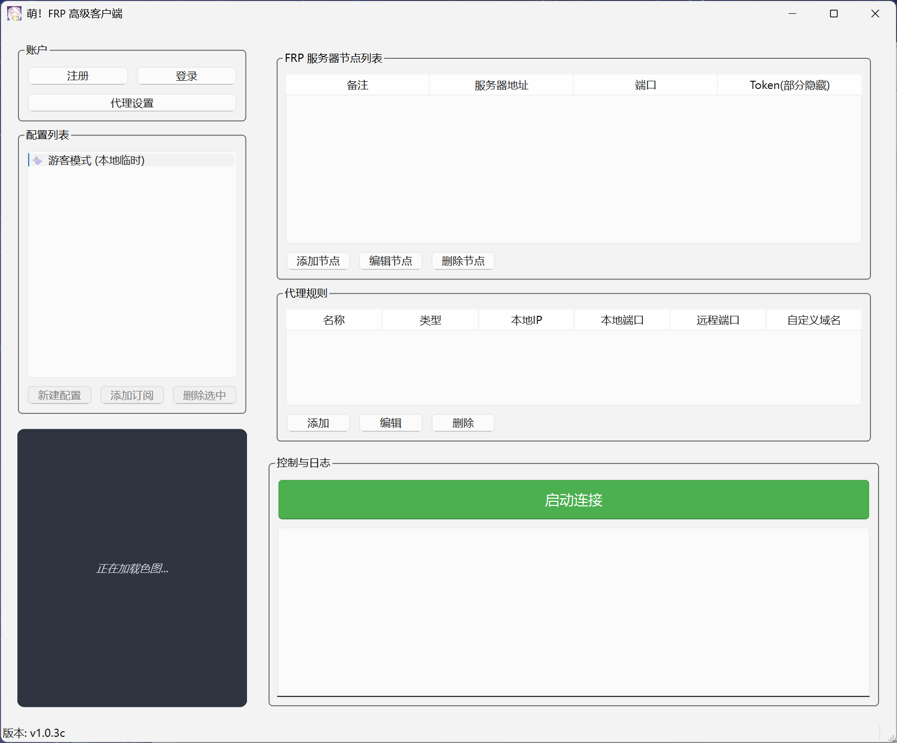
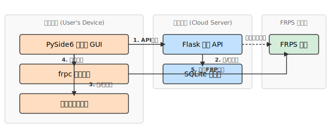

# 萌！FRP 高级客户端 / Moe! FRP Client

<div align="center">
 
> ⚠️ **提示**：本项目部分代码由 Google Gemini 2.5 Pro 辅助编写。


[](https://github.com/XMZO/MoeFrpClient/stargazers)

一份为 [frp](https://github.com/fatedier/frp) 设计的、集成了云同步与配置分享功能的现代化桌面客户端。

A modern desktop client for [frp](https://github.com/fatedier/frp), featuring cloud synchronization and profile sharing capabilities.

</div>



## 🏗️ 架构 / Architecture



---

<details>
<summary><strong>中文说明 (Click to expand)</strong></summary>

## 简介

**萌！FRP 客户端** 是一个基于 Python 和 PySide6 构建的 `frp` 图形化工具。它旨在提供一个比原生命令行更直观、更易于管理的 `frpc` 操作体验，并引入了**云端同步**和**配置分享**等高级功能，旨在为 `frp` 用户提供一个功能更丰富、操作更便捷的图形化管理方案。

## ✨ 主要功能

### **账户与配置管理**
*   **多模式配置**:
    *   **游客模式**: 无需登录，用于本地临时配置和快速测试。
    *   **云端配置**: 登录后，个人配置将自动与云端服务器同步，实现多设备共享。
    *   **订阅模式**: 支持一键添加他人分享的配置，并能与分享源保持同步更新。
*   **完整的用户系统**: 支持用户注册、登录，并提供安全的、基于令牌的密码重置流程。
*   **强大的分享系统**:
    *   **完整分享**: 分享一个固定的、不可修改的 `frp` 配置包。
    *   **模板分享**: 分享一个可定制的模板，允许订阅者选择节点、自定义本地端口等。
    *   **分享管理**: 用户可以随时查看、管理或撤销自己创建的分享。

### **安全机制**
*   **客户端校验**: 客户端与服务器之间通过版本密钥和核心组件哈希进行严格的双向校验，防止非法客户端接入。
*   **挑战-响应登录**: 登录过程采用动态挑战码 (`Challenge`) 与登录证明 (`Proof`) 机制，有效防御重放攻击。
*   **分层本地加密**: 应用设置和“记住密码”等敏感信息，使用派生自机器唯一ID的密钥进行二次加密后，安全地存储在操作系统的密钥环 (Keyring) 中。
*   **防爆破延时**: 登录时采用基于 **Argon2** 的计算密集型延时，显著增加暴力破解的攻击成本。
*   **服务端安全**: 后端使用强密码哈希（Argon2）并对核心API（如登录、注册）设置了速率限制，以抵御恶意请求。

### **用户体验优化**
*   **智能日志解析**: 自动解析 `frpc` 的原始日志，仅呈现“代理启动成功”、“连接失败”等关键的、结构化的信息。
*   **美观的UI与交互**: 每次启动时从多个在线API源随机获取背景图片，并内置了支持 GIF 动画、无级缩放、拖动平移和右键保存的高级图片查看器。
*   **一键节点测速**: 快速测试所有服务器节点的网络延迟，并直观地在下拉列表中展示结果。
*   **应用级代理**: 支持独立设置客户端自身的网络代理（HTTP/SOCKS5），用于API请求和图片下载，该设置不影响`frp`核心隧道的连接。
*   **灵活的账户管理**: 提供“退出登录”（保留凭证）和“切换账户”（清除凭证）两种退出方式。

## 🚀 部署与使用

### **1. 核心组件说明**
*   **MoeFrpClient.mfc**: 这是 `frpc` 的核心动态链接库。 **你必须提供此文件**，并将其与主程序 `main.py` 放置在同一目录下，客户端才能启动FRP隧道。
*   **server.py**: 这是可选的后端服务器。如果你想拥有自己的账户系统和云同步功能，你需要部署它。如果你只是想连接到一个已有的服务，你则无需关心此文件。
*   **generate_invite_code.py**: 服务端管理工具，用于生成邀请码、管理用户等。

### **2. 服务端部署 (自托管用户)**
```bash
# 1. 进入服务端目录
cd server

# 2. (推荐) 创建并激活虚拟环境
python -m venv venv
# Windows: venv\Scripts\activate | macOS/Linux: source venv/bin/activate

# 3. 安装依赖
pip install -r requirements.txt

# 4. 首次运行会自动初始化数据库
python server.py
```
**管理员设置**: 为了使用重置密码等高级功能，你需要手动为你注册的账户提升权限。使用任何SQLite工具打开 `server/users.db` 文件，并执行：
```sql
UPDATE users SET role = 'admin' WHERE nickname = '你的管理员昵称';
```

### **3. 客户端安装**
```bash
# 1. 克隆本仓库并进入项目根目录
git clone https://github.com/XMZO/MoeFrpClient.git
cd MoeFrpClient

# 2. (推荐) 创建并激活虚拟环境
python -m venv venv
# Windows: venv\Scripts\activate | macOS/Linux: source venv/bin/activate

# 3. 安装依赖
pip install -r requirements.txt

# 4. [可选] 如需使用SOCKS5代理，请额外安装
pip install "requests[socks]"
```

### **4. 客户端配置与运行**
*   **连接自建服务器**: 如果你部署了自己的后端，请修改 `client/config.py` 文件中的 `CLOUD_SERVER_URL` 为你的服务器地址。
*   **启动客户端**: 确保 `MoeFrpClient.mfc` 文件已放置在 `client` 目录下，然后运行：
    ```bash
    python client/main.py
    ```

### **5. 服务端管理**
如果你是服务器管理员，可以使用管理工具与用户和邀请码进行交互：
```bash
# 进入服务端目录
cd server

# 以交互模式启动管理工具
python generate_invite_code.py
```
该工具会提示你输入操作选项，对于重置密码等敏感操作，会要求你使用管理员账户登录以进行授权。

## 🤝 贡献

欢迎任何形式的贡献。如果您有改进建议或发现 Bug，请随时提出 Issue。如果您希望贡献代码，请遵循标准的 Fork & Pull Request 流程。

## 📄 开源许可

本项目基于 [MIT License](LICENSE) 开源。
This project uses the [frp](https://github.com/fatedier/frp) binary (`frpc`) which is licensed under the Apache License 2.0.
See `third_party/frp/LICENSE` for details.

</details>

---

<details>
<summary><strong>English Description (Click to expand)</strong></summary>

## Introduction

**Moe! FRP Client** is a graphical tool for `frp` built with Python and PySide6. It aims to provide a more intuitive and manageable user experience for `frpc` compared to the native command line, introducing advanced features like **cloud synchronization** and **profile sharing** to provide a more feature-rich and user-friendly graphical management solution for frp users.

## ✨ Key Features

### **Account & Profile Management**
*   **Multi-Mode Configuration**:
    *   **Guest Mode**: No login required for local, temporary configurations and quick testing.
    *   **Cloud Profiles**: After logging in, personal profiles are automatically synchronized with the cloud server for multi-device access.
    *   **Subscription Mode**: Supports one-click subscription to profiles shared by others, with automatic updates from the source.
*   **Complete User System**: Supports user registration, login, and a secure, token-based password reset process.
*   **Powerful Sharing System**:
    *   **Full Share**: Share a fixed, non-editable `frp` configuration package.
    *   **Template Share**: Share a customizable template that allows subscribers to select nodes, define local ports, etc.
    *   **Share Management**: Users can view, manage, or revoke their created shares at any time.

### **Security Mechanisms**
*   **Client Validation**: Strict two-way validation between the client and server using a version secret and core component hash to prevent unauthorized client access.
*   **Challenge-Response Login**: The login process employs a dynamic challenge and proof mechanism to effectively defend against replay attacks.
*   **Hierarchical Local Encryption**: Sensitive information, such as application settings and "Remember Me" credentials, is encrypted with a key derived from a unique machine ID and securely stored in the OS's native Keyring.
*   **Anti-Brute-Force Delay**: A computationally intensive delay based on **Argon2** is implemented during login to significantly increase the cost of brute-force attacks.
*   **Server-Side Safeguards**: The backend uses strong password hashing (Argon2) and rate-limits core APIs (e.g., login, register) to mitigate malicious requests.

### **User Experience Enhancements**
*   **Intelligent Log Parsing**: Automatically parses raw `frpc` logs to present only key, structured information, such as "Proxy started successfully" or "Connection failed".
*   **Aesthetic UI & Interaction**: Fetches a random background image on startup from multiple online API sources and includes an advanced image viewer with GIF support, smooth zooming, panning, and right-click save.
*   **One-Click Node Ping Test**: Quickly tests the network latency of all server nodes and displays the results intuitively in a dropdown list.
*   **Application-Level Proxy**: Supports independent configuration of a network proxy (HTTP/SOCKS5) for the client itself, used for API requests and image downloads, without affecting the core `frp` tunnel connection.
*   **Flexible Account Management**: Differentiates between "Logout" (keeps credentials) and "Switch Account" (clears credentials).

## 🚀 Deployment & Usage

### **1. Core Component Explanation**
*   **MoeFrpClient.mfc**: This is the core dynamic link library for `frpc`. **You must provide this file** and place it in the same directory as the main program (`main.py`) for the client to establish FRP tunnels.
*   **server.py**: This is the optional backend server. You need to deploy it if you want your own account system and cloud sync features. If you are just connecting to an existing service, you can ignore this file.
*   **generate_invite_code.py**: The server management tool for generating invitation codes, managing users, etc.

### **2. Server Deployment (For Self-Hosters)**
```bash
# 1. Navigate to the server directory
cd server

# 2. (Recommended) Create and activate a virtual environment
python -m venv venv
# Windows: venv\Scripts\activate | macOS/Linux: source venv/bin/activate

# 3. Install dependencies
pip install -r requirements.txt

# 4. The database will be initialized on the first run
python server.py
```
**Admin Setup**: To use advanced features like password resets, you need to manually elevate your account's privileges. Open `server/users.db` with any SQLite tool and execute:
```sql
UPDATE users SET role = 'admin' WHERE nickname = 'your_admin_nickname';
```

### **3. Client Installation**
```bash
# 1. Clone this repository and navigate to the project root
git clone https://github.com/XMZO/MoeFrpClient.git
cd MoeFrpClient

# 2. (Recommended) Create and activate a virtual environment
python -m venv venv
# Windows: venv\Scripts\activate | macOS/Linux: source venv/bin/activate

# 3. Install dependencies
pip install -r requirements.txt

# 4. [Optional] For SOCKS5 proxy support, install this extra
pip install "requests[socks]"
```

### **4. Client Configuration & Launch**
*   **Connecting to Your Own Server**: If you've deployed your own backend, edit the `CLOUD_SERVER_URL` in `client/config.py` to your server's address.
*   **Running the Client**: Ensure the `MoeFrpClient.mfc` file is in the `client` directory, then run:
    ```bash
    python client/main.py
    ```

### **5. Server Management**
If you are the server administrator, use the management tool to interact with users and invitation codes:
```bash
# Navigate to the server directory
cd server

# Start the management tool in interactive mode
python generate_invite_code.py
```
The tool will prompt you for actions. For sensitive operations like resetting a password, it will require you to log in with your admin account for authorization.

## 🤝 Contributing

Contributions of any kind are welcome. If you have suggestions for improvement or find a bug, please feel free to open an Issue. If you'd like to contribute code, please follow the standard Fork & Pull Request workflow.

## 📄 License

This project is licensed under the [MIT License](LICENSE).
This project uses the [frp](https://github.com/fatedier/frp) binary (`frpc`) which is licensed under the Apache License 2.0.
See `third_party/frp/LICENSE` for details.

</details>
